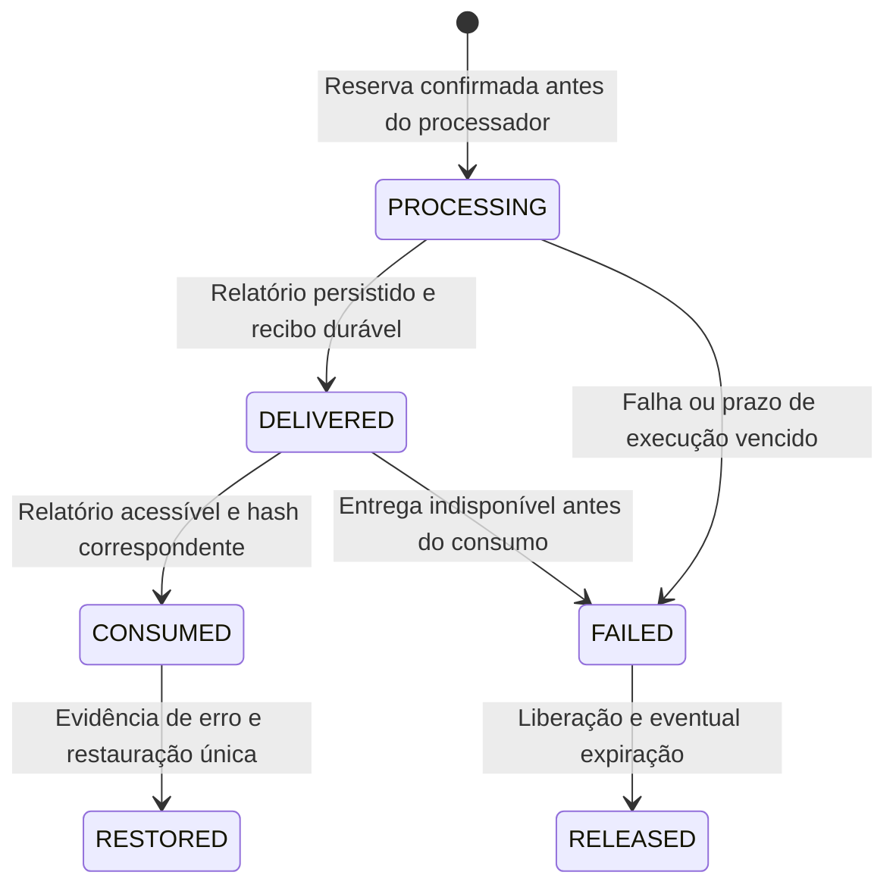

# FROID Psique — Trial e créditos V2, Fase 2A

Estado em 29/09/2026: núcleo de backend implementado e testado localmente. [Relatório e evidências](psique-v2-fase2a-relatorio.md). O fluxo público continua V1. Este documento não autoriza ativação, publicação ou operações Stripe.

## Integração entregue

`psique_identity.py` define a evidência de identidade e material. `psique_credits.py` executa comandos transacionais no PostgreSQL. `psique_analysis.py` contém `AnalysisWorkflow.run()`: reserva, chama o processador fornecido pelo backend, persiste a entrega, verifica sua leitura autorizada e consome. Os testes exercitam esse percurso com material e resultado declaradamente sintéticos.

Não há ligação nova com `main.py`, onboarding, WebSocket ou telas. O adaptador não executa sozinho o motor clínico: recebe um processador que deve devolver `CompletedAnalysis` com resultado protegido e prova de conclusão técnica/resultado mínimo. A integração com o pipeline real e seus provedores de evidência precisa ser homologada antes de atender pacientes; não foi apresentada como E2E do produto.

O chamador é código autenticado do servidor. `AccessContext`, `TrialIdentity`, `AuthorizedMaterial`, conclusão técnica e evidência de entrega não podem ser construídos a partir de declarações do navegador. A função SQL confere vínculo ativo, organização, usuário e papéis efetivamente persistidos. Uma propriedade `roles` forjada no contexto não concede privilégio.

## Carteira e eventos

São usadas as estruturas existentes `organization_wallets` e `credit_ledger`. `credit_model='v1'` permanece o padrão. A adesão explícita a `psique_v2` só aceita carteira vazia e sem qualquer lançamento anterior; define autoridade compartilhada e audita a operação. Não migra saldos V1 nem cria lotes/FIFO.

`available_balance = balance - reserved_balance`. As três quantidades não podem ficar negativas; a reserva não pode superar o saldo. Cada comando financeiro bloqueia a linha da carteira com `FOR UPDATE`. O instante de referência é obtido depois do lock.

| Evento V2 | Variação do saldo | Variação reservada | Condição |
|---|---:|---:|---|
| `TRIAL_GRANT` | +10 | 0 | Elegibilidade verificada, uma vez |
| `TRIAL_EXPIRATION` | Menos o Trial livre vencido | 0 | Preserva pago e reserva em andamento |
| `CREDIT_RESERVATION` | 0 | +1 | Fonte nova, saldo disponível |
| `CREDIT_CONSUMPTION` | -1 | -1 | Entrega durável acessível |
| `CREDIT_RELEASE` | 0 | -1 | Falha sem entrega utilizável |
| `CREDIT_RESTORE` | +1 | 0 | Consumo original, motivo e evidência |
| `MANUAL_ADJUSTMENT` | +/-N | 0 | Administrador autorizado, motivo e idempotência |
| `CREDIT_PURCHASE` | +N | 0 | Apenas modelagem e fixture sintética nesta fase |

O runtime não recebe comando de compra nem permissão para chamar a primitiva interna de crédito. Ajuste negativo só pode retirar pago livre. O histórico V2 é imutável; eventos V1 em minúsculas mantêm a semântica original e são recusados em carteira explicitamente V2.

## Trial e prova histórica

O Trial concede dez créditos por organização, compartilhados pelos membros, válidos por 336 horas (14 dias) desde a concessão. Convidados não concedem Trial. Falta de saldo impede nova fonte faturável, com `INSUFFICIENT_CREDITS`; não altera autenticação nem o direito a entregas já existentes. Fontes já consumidas continuam reprocessáveis sem saldo.

O `identity_loader(user_id)` deve consultar registros confiáveis de e-mail verificado **e** histórico de benefício V1. Deve retornar `verified_at`, referência da verificação e `legacy_history_checked=True` somente depois dessa consulta. Histórico não consultado, identidade divergente ou verificação ausente/futura bloqueiam a concessão. Benefício V1 comprovado exige `legacy_benefit_ref`: registra inelegibilidade histórica, sem crédito novo. Os provedores de produção não foram conectados nesta fase.

Normalização do e-mail: `strip().lower()`, preservando pontos e `+alias`. HMAC-SHA256 usa chaves externas, nunca gravadas em tabela ou repositório:

- `FROID_PSIQUE_TRIAL_HMAC_KEYS`: objeto JSON de versão para segredo codificado em Base64; cada segredo precisa de pelo menos 32 bytes.
- `FROID_PSIQUE_TRIAL_HMAC_ACTIVE_VERSION`: versão ativa existente nesse objeto.

Os exemplos de ambiente deixam os valores vazios, e o Compose encaminha ambas as variáveis. Valores vazios bloqueiam nova concessão. Na rotação, conservar as chaves de todas as versões já registradas. A aplicação calcula os identificadores de todas as versões disponíveis; a falta de uma versão histórica falha explicitamente. Locks de elegibilidade e unicidade impedem concessões concorrentes para o mesmo e-mail em organizações distintas.

`psique_trial_eligibility` retém HMAC, versão, beneficiário, origem V1/V2 e referência de evidência; não guarda e-mail aberto ou segredo. Identificadores históricos não têm FK de exclusão para a conta. Atualização/exclusão são recusadas, preservando a evidência após encerramento. Não há backfill automático do histórico V1.

## Vencimento e origem do crédito

O Trial é reservado antes do pago. `credits_used`, `credits_reserved` e `credits_expired` mantêm a origem sem lotes pagos. O Trial livre é `credits_granted - credits_used - credits_reserved - credits_expired`; descontar `credits_expired` impede uma segunda expiração do mesmo benefício.

Uma reserva feita antes do vencimento vale apenas para sua tentativa. Se concluir depois, consome normalmente. Se falhar depois, liberação e expiração compensatória ocorrem na mesma transação. Restore de consumo Trial vencido também produz restore e expiração na mesma transação. Nenhum desses caminhos transforma Trial vencido em saldo pago.

Expiração é calculada nos comandos que usam o saldo; `expire_trial()` permite execução explícita. Não foi instalado agendador periódico. A data de vencimento permanece registrada, e uma nova reserva sempre revalida o prazo no servidor.

## Identidade e bytes do material

O `material_loader(user_id, reference)` precisa autorizar sessão/material e retornar organização, usuário proprietário e `material_key` UUID estável, criado e retido pelo backend. A referência recebida do cliente serve para localizar o registro, nunca como prova de propriedade.

O PostgreSQL emite `analysis_source_id`. Organização/material são únicos; proprietário, sessão, tipo e hash são imutáveis. O índice `psique_one_consumption_per_source` limita a fonte a um `CREDIT_CONSUMPTION`, inclusive após restore. Reanálise, novo modelo e regeneração reutilizam a mesma fonte, com nova execução; material novo usa nova identidade.

Para arquivo, SHA-256 é atualizado incrementalmente com os bytes originais fornecidos pelo carregador. Não se calcula sobre transcrição ou arquivo transformado. Não há retenção adicional de áudio. Para streaming, `source_sha256` permanece `NULL`: **hash não apurado**. Manifesto avançado de chunks foi adiado, como permitido no prompt.

## Entrega, falha e reconciliação



O diagrama combina estados da tentativa, da reserva e eventos financeiros. Tentativas usam `PROCESSING/DELIVERED/FAILED`; reservas usam `RESERVED/CONSUMED/RELEASED`.

`DELIVER` persiste em `session_reports` sob a chave `psique-v2:<source_uuid>`, sem substituir relatório V1. Registra `report_id`, `technical_completed_at`, `delivered_at` e SHA-256 do JSONB persistido. O comando exige resultado mínimo/conclusão técnica, objeto não vazio e recusa transcrição aberta. Esse limite não substitui a proteção/deidentificação do relatório pelo produtor clínico.

Entrega e consumo são transações separadas: uma confirmação perdida não apaga o relatório. `CONSUME` confere novamente proprietário, organização, ausência de exclusão e hash do recibo, sob lock do relatório. Resultado clinicamente inconclusivo pode ser válido quando tecnicamente entregue. Sem entrega durável utilizável, não há consumo.

Cada início exige `lease_until` explícito; esta fase não inventa um timeout clínico. `heartbeat()` prorroga uma tentativa ainda vigente. O worker precisa definir e renovar o prazo conforme sua operação. Após morte do worker, `reconcile_pending(context)` encontra suas tentativas vencidas e libera reservas; entregas pendentes são consumidas idempotentemente. Relatórios indisponíveis geram erro visível e exigem liberação ou, se já consumidos, restore com evidência. Falhas de banco não são tratadas como liberação concluída.

Não foi instalado serviço de varredura. A homologação do chamador precisa demonstrar heartbeat e invocação periódica da reconciliação, inclusive o tratamento operacional de vínculos encerrados. Reconciliação nunca apaga relatório. Restaurar exige papel atual owner/administrator, motivo, evidência e consumo da própria organização; não é refund financeiro externo.

## Privilégios e validação

O runtime restrito recebe `SELECT` de `schema_migrations` e `EXECUTE` de `psique_v2_credit_command`, além dos grants legados já existentes. Não recebe escrita direta em carteira, ledger ou tabelas 2A, execução de primitivas internas ou DDL. As tabelas novas têm RLS. O comando com `SECURITY DEFINER` tem search path fixo e verifica contexto/vínculos/papéis antes das operações. Isso não constitui RBAC V2 completo.

O migration role executa DDL e registra a auditoria pelo runner explícito. Criar/remover bancos é privilégio da infraestrutura de testes descartáveis, não do runtime. Homologar Linux, owner das funções, grants reais e integração com as políticas do produto antes da ativação.

Com ambiente de teste dedicado já configurado:

```powershell
python -m pytest froid-server/tests/test_psique_phase2a.py -q -p no:cacheprovider
```

O teste usa exclusivamente `FROID_PSIQUE_TEST_DATABASE_URL`, exige host local e nome `psique_v2_test_...`, cria banco filho aleatório, aplica migrations explicitamente e o remove ao terminar. Sem essa configuração, os casos PostgreSQL são pulados; isso não vale como aprovação da Fase 2A. A execução registrada no relatório passou com PostgreSQL real e não teve esses skips.
